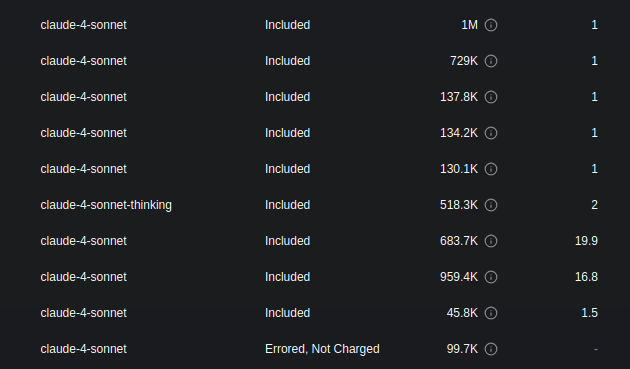
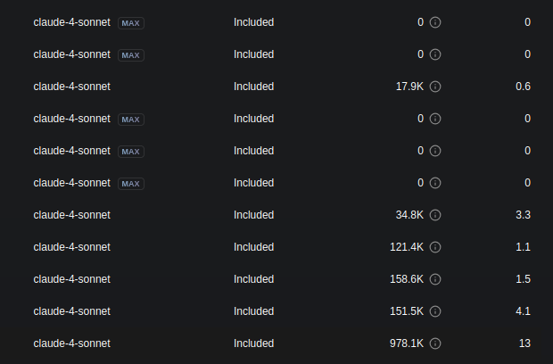
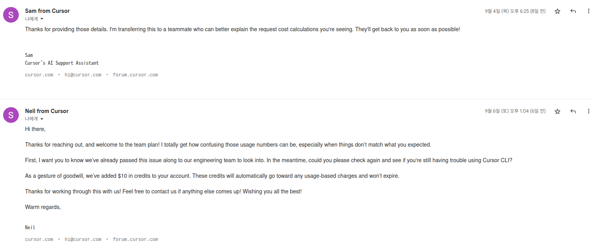

# 클로드 코드 vs 커서 비교 사용기

## Intro

Claude Code와 Cursor 둘 다 요즘 아주 핫한 AI 코딩 Agent다. 그런데 아쉽게도 아무리 찾아봐도 이 둘의 사용기를 자세히 적어둔 글이 잘 없다. 그저 X를 보다보면 Claude 구독을 시작하며 Cursor를 해지하게 되었다는 사람들이 종종 눈에 띌 뿐이다. 딱히 이유도 친절히 알려주지 않는다. 그래서 직접 사용해보고 비교하기로 했다.

보통은 Cursor에서 Claude Code로 갈아탄 케이스가 대부분일텐데, 나는 반대로 Claude Code에서 Cursor로 넘어간 케이스다. 

Claude Code를 만족하며 사용해왔지만 Pro 플랜이 업무용으로 사용하기에는 제한에 너무 자주 걸렸다. MAX는 금액이 부담되는 상황에서, 마침 Cursor CLI가 나왔다고 하여 회사에서 지원해주는 Cursor Team Plan($40) 에 참여했다. 

시작할 때만 해도 Cursor CLI만 사용할 예정이었다.

## Cursor CLI

Team Plan 에서는 월 총 500회의 사용량 제한이 있다. 그런데 버그인지 Cursor-CLI를 쓰면 토큰수에 비해 사용량이 말도안되게 빠져나갔다.

> 맨 위의 1, 1, 1, 1, 1 , 2를 제외한 모든 소수점 있는 요청들이 Cursor CLI로 보낸 요청이다. 
>
> 683.7K 토큰짜리 요청이 무려 19.9 request 를 사용했다. 위의 커서 IDE 에서 보낸 요청을 보면 1M 짜리도 1회만 차감할 뿐인데 말이다.
>
> 컨텍스트가 쫌 늘어난다 싶으면 맛이 가고 응답을 안한다. 사용량 조회를 해보면 말도 안되는 `MAX` 딱지 붙여놓고 저상태로 되어있다.

분명한 버그라서 Cursor 팀에 문의도 남겼는데, 미안하다고 $10  넣어 줬다고 하곤 그 이후로 일주일째 소식이 더이상 없다.

비용은 차치 하더라도, Claude Code와의 비교를 위해 끝까지 CLI를 고집하고 싶었으나 문제가 너무 많다. 

토큰수가 조금만 많아지면 응답도 안오는 일이 비일비재하고, 차라리 응답이 안오면 다행이지 혼자서 이상하게 주저리 주저리 하며 토큰만 한참동안 계속 쓰며 아무런 액션이 없을 때가 많다. 나름대로 Claude Code랑 같은 기능을 구현하려고 UI/UX 는 아주 흡사하게 했는데 핵심 기능이 꽝이다. 한동안 Beta 딱지를 떼기는 힘들 것 같다. Cursor CLI는 지금기준으로는 도저히 써먹을만한게 아니란 결론을 내렸다. 그래서 지금부터의 비교는 기존의 Cursor IDE와 한다.

## 비교기

### 커밋

`Claude Code`에서 "커밋해줘"라고 하면 정말 알아서 다 해준다. 최근 커밋들을 조회해서 커밋 메시지 컨벤션을 확인하고, 최종 커밋으로부터의 변경사항들을 체크해서 적절한 커밋 메시지를 작성한다.

더 놀라운 건, 디버깅을 위해 코드 중간에 삽입했던 `System.err.println()` 같은 전혀 커밋에 포함할 의도가 없는 코드가 있다면 말하지 않아도 알아서 거르고 커밋해준다는 점이다. 사소한 작업 하나하나도 허투루 하지 않고 다 확인하며 한다는 증거다.

커밋 컨벤션을 지키는 선에서 최대한 자세히 커밋 메시지를 작성하고는 마지막에는 본인이 같이 코드에 참여했다고 Co-Authored-By에 자기 이름까지 껴넣는다. 커밋에서의 여러 디테일이 정말 인상깊었다.

`Cursor`에서도 커밋을 시켜봤는데 커밋 컨벤션이고 뭐고 지맘대로 커밋한다. 당연히 주절주절 최근 깃 히스토리 보고 컨벤션 확인하고 비슷하게 메시지 입력하고 뭐 구현했는지 어떻게 표현하고... 이런 것들을 다 말해주면 그대로 하긴 한다. 그런데 그렇게 말 안해주면 안한다. Claude Code에서는 "커밋 해줘" 한마디면 다 알아서 했던 것들인데 말이다.

더 놀라운 일은 그 후에 발생했으니, Cursor에서 컨텍스트를 유지한 상태에서 다른 코드수정을 추가로 시켰더니 코드 변경후에 자기 맘대로 그냥 커밋까지 해버린다. 수정한 내용에 대한 검토나 테스트 따위는 신경쓰지 않는다.

그래서 이걸 니 맘대로 커밋하냐고 뭐라했더니 다짜고짜 `git reset`을 해버린다. `--soft`나 `--mixed`면 말도 안한다. `--hard` 붙여서 그냥 다 날려버렸다. 좀 뭐라 그랬다고 삐졌나? 이때 진짜 얘는 뭔가 싶었다.

마지막 프롬프트로부터의 코드 변경사항이 마음에 들지 않았을 때, 마지막 커밋 이후에 작업한 내용이 남아있는 상태에서 코드를 되돌리자고 할 때의 차이도 컸다.

Claude Code에서는 마지막 프롬프트에서 추가한 작업들만 되돌렸지만, Cursor에서는 어쩌라고 하며 `git restore`를 수행해버린다. 작업 내용 날려먹고선 뻔뻔하게 깔끔해졌다고 하며 혼자 뿌듯해하는건 덤이다.

### Claude-4-Sonnet-Thinking

Cursor에서의 claude-4-sonnet 모델은 Claude Code에서의 Sonnet4와 비교했을때 같은 모델이 맞나 싶을 정도로 체급 자체가 부족한 느낌이었는데, 구세주가 나타났으니 **Thinking** 모델로 바꾸니 "나 적어도 모델은 같은게 맞아요"라는걸 이해하고 받아들일 수 있을 정도는 됐다. 아마 Claude Code 에서는 Cursor에서 말하는 Thinking 모델이 기본 모델인 모양이다.

다행히도 근본적으로 해결되지 못하는 문제들은 차치하더라도 Thinking 붙여놓고 쓰면 그래도 Claude Code 쓰던 경험의 80% 이상은 커버가 되었다. 쓸만 하는 이야기다.

다만 여전히 토큰 사이즈에 무관하게 한달에 정해져있는 요청 횟수 제한 기반으로 과금되는 시스템 상 어떻게든 한번에 뱉어내려고 하는 경향이 있어 잔걸음으로 코딩하기가 힘들다. 한번에 최대한 충분한 컨텍스트를 제공하며 작업이 잘 되기를 바라는 기도 메타가 주류인 이유다.

AI와의 협업에서 짧은 호흡으로 같이 Align 하며 잦은 커밋을 통해 세밀하게 작업 내용을 진행하는 내 스타일로 `x2`인 Thinking 모델을 쓰니 일주일만에 남은 리퀘스트가 거의 바닥이다.

### 다중 모델 지원

Cursor의 경우에는 여러 벤더의 다양한 모델에서 모두 동작할 수 있는 구조라서, 사용자들의 서로 다른 수요에 맞춰 다른 모델을 선택할 수 있다는 얼핏 보면 장점처럼 비춰진다.

하지만 iOS와 안드로이드에 빗대보면 쉽게 이해할 수 있을텐데, iOS는 애플의 한정된 소수의 핸드폰에서만 작동하기로 약속되어 있기 때문에 메모리, 배터리, 성능 등의 최적화에서 큰 이점을 가진다. 관리포인트가 늘어난다는건 피곤한 일이다.

Sonnet, GPT-5 등 여러 모델을 번갈아가며 사용해봤지만 결국 Sonnet Thinking만 선택하고 사용하게 되었다.

Cursor를 쓰면서도 결국 한가지 주력 모델만 사용하게 되기 때문에 여러 모델 중 선택할 수 있다는게 굳이 장점이 될 수 있을지 모르겠다. 한곳에 의지하다가는 불확실성에 대응이 안되니 여러 모델을 사용할 수 있다는건 고객의 편의보다는 어쩔 수 없는 생존 전략일 것이다.

## Claude Code 강점

Claude Code에서는 컨텍스트 확대가 필요하다면 알아서 코드베이스 찾아보는데 시간을 추가로 할애한다. 될 때까지 말이다. Claude에서는 사용자가 토큰을 많이 쓰는 거에 별로 개의치 않으므로 수익 모델상 최대한 토큰을 아껴야 하는 Cursor는 꿈도 못 꿀 이야기다.

서버에 배포할 때도 Claude Code 하나만 딸랑 설치해두고 채팅 몇 번 하면 필요한 세팅 아주 쉽게 싹다 할 수 있다. 에러가 발생해도 스스로 알아서 대응해주기 때문에 에러메시지 읽고 대응하고, 모르는건 LLM에 물어보고 하라는대로 다시 복사해서 실행하고 하는 등의 번거로운 작업이 아주 간소화 된다. 터미널을 종료해도 나중에 `/resume`으로 이어갈 수 있다는 것도 큰 장점이다.

psql 같은 걸로 스스로 테이블도 뭐있는지 확인하고 쿼리도 직접 날려보면서 확인한다. Solr 같은 검색엔진도 주소만 알려주면 curl로 스스로 쿼리 날려보며 작업한다. 이런 주도적인 모습이 굉장히 인상깊다.

docker 컨테이너들도 알아서 오케스트레이션 한다.

필요할 때 스스로 서브에이전트를 생성하여 병렬작업한다는 점도 놀라웠다.

## 결론

### cursor를 쓰며 달라진 점들

- **AI와 싸우는 일이 늘었다**: Claude Code에서는 알아서 하던 것들을 Cursor에게 구구절절 일일이 설명해야 한다.
- **타이핑이 늘었다**: 위의 이유로 컨텍스트를 주구절절 설명하느라 타이핑 양이 늘었다.
- **Rule 설정의 필요성**: Cursor에서 rule을 추가해야 잘 사용할 수 있다고 하는데 그게 이해가 된다. 하지만 Claude Code를 사용했던 입장에서는 굳이 코드에 다 녹아들어 있는 내용들을 주구절절 다시 설명해야 한다는게 받아들이기 어렵다.

### 새롭게 깨달은 것들

- **5 hours window limit의 관대함**: Claude Code $20 요금제의 5시간 제한이 사실 엄청 후한 거였다는걸 깨달았다. context만 한번씩 clear 혹은 compact 해주면 그래도 나름 꽤 쓴다. 요금제를 따지고 보면 가성비면에서 사실 MAX플랜이랑 비교해도 Claude 압승이다. Cursor에서 Opus 모델을 계속 쓴다면 사용요금이 과연 $100~$200 에서 끝날 수 있을까?
- **Auto Accept**: Claude Code에서는 auto accept를 쓰면 땡이라서, Cursor 사용자들의 `눈으로 보고 판단해야 해서 에디터가 필요하다`는 주장을 납득할 수 없었지만 이제는 이해할 수 있게 됐다. Cursor의 결과물은 auto accept 했다가는 다시 고치는데 시간이 더 걸릴 것이다.

### 그 외 차이

집에서는 Mac, 회사에서는 Ubuntu OS를 사용하니 터미널 환경이 훨씬 편하고 기능이 강력하다. Windows 를 썼다면 Cursor를 썼을지도 모르겠다.

그리고 애초에 Cursor와 Claude Code 는 직접 비교할만한 비교군이 아니라고 생각한다. 프레임워크와 라이브러리의 차이, 즉 **Inversion Of Control**을 생각해보면 된다. Cursor를 썼을 때는 Cursor의 도움을 받아 내가 주도적으로 코딩을 했다면 Claude Code는 Claude가 스스로 알아서 하고 난 그걸 매니징할 뿐이다.

### 최종 결론

내겐 알잘딱깔센 Claude Code 이 훨씬 잘 맞았다.

사실 여러 차이들이 존재하지만, 각자의 환경과 필요에 따라 더 적합한 도구가 다를 수 있다. Cursor도 분명히 장점이 있고, 특히 에디터와 긴밀하게 통합된 환경을 선호하는 사람들에게는 좋은 선택이 될 수 있다. 

다만 터미널 환경에 익숙하고 Claude Code를 먼저 써본 입장에서는 AI가 더 주도적으로 알아서 센스있고 섬세하게 작업을 해주는 쪽이 훨씬 편리했다는게 솔직한 소감이다.

참고할만한 기타 후기들

- https://www.reddit.com/r/ChatGPTCoding/comments/1l8w2h4/difference_between_using_cursor_and_claude_code/
- https://blog.naver.com/khjkhj2804/223927854451
- https://news.hada.io/topic?id=22375
