# 개발자와 CHATGPT

## Intro

소프트웨어 개발에서 가장 큰 비용은 무엇일까?

사무실 임대료, 클라우드 서버 비용, 전기요금, 노트북 등 장비 구매비용, 직원들의 식비까지—이 모든 항목이 소프트웨어 개발을 구성하는 요소들이다. 하지만 그 중에서도 단연코 가장 큰 비중을 차지하는 건 인건비고, 인건비 앞에서는 다른 비용들은 그저 껌값일 뿐이다.

> 인건비는 단순히 직원들이 받는 월급뿐만 아니라, 4대 보험 회사 부담분, 퇴직금, 연차수당, 교육비, 단체보험료, 채용비, 인사관리비용과 같은 다양한 항목으로 구성되어 있으며, 이러한 비용들은 조직에 상당한 부담을 준다.

이처럼 소프트웨어 개발의 핵심 비용 구조가 인력에 집중되어 있다 보니, 최근의 대규모 언어 모델(LLM)과 같은 혁신적인 기술이 큰 주목을 받고 있다. LLM은 단순한 비정형 데이터 처리부터 기획, 설계, 배포에 이르는 소프트웨어 개발의 전 과정을 지원하며, 개발자와 기업이 부담해야 할 시간적·경제적 비용을 획기적으로 절감할 수 있는 잠재력을 가지고 있기 때문이다.

특히 ChatGPT와 같은 모델은 단순히 생산성을 높이는 것을 넘어, 고비용 인력 중심 업무를 자동화하거나 보조하며, 소프트웨어 개발의 비용 구조를 근본적으로 변화시킬 가능성을 보여줬다.

## LLM

### LLM이란

대규모 언어 모델(LLM)은 인간 언어를 이해하고 생성하는 AI 모델로, 텍스트 데이터에서 단어 간의 관계를 학습해 다음 단어를 예측한다. 이를 통해 문장 생성, 번역, 요약 등 다양한 자연어 처리 작업을 수행하며, 비정형 데이터(자연어) 처리의 한계를 극복했다.

Transformer 구조의 도입으로 LLM은 긴 텍스트와 문맥을 더 잘 이해하고, 방대한 데이터를 학습해 다양한 도메인에서 활용할 수 있게 되었다.

### ML Workflow의 변화

LLM은 기존 머신러닝처럼 데이터 준비와 모델 개발에 많은 시간을 들이지 않고도, 프롬프트 설계만으로 빠르게 결과를 얻을 수 있다.

- **전통적 방식**: 데이터 준비 → 모델 학습 → 배포 (수 개월~ 1년 이상 소요)
- **LLM 방식**: 프롬프트 설계 → 즉시 배포 (수 시간~며칠 소요)

데이터 인터프리터 (비정형 <-> 정형 데이터) 역할을 하던 고액 연봉을 받는 직군(의사, 변호사, 증권맨..)의 일을 대신할 수 있게 되었으며, 막대한 비용 없이도 프롬프트 설계만으로 LLM을 누구나 저렴하게 활용할 수 있게 되었고 그로인해 경영진 레벨에는 큰 기회와 위기가 되었다.

### CHATGPT

#### ▸ 등장 및 역사

OpenAI가 ChatGPT를 2022년 11월 말 공개하면서 전 세계적인 주목을 받았다. 이후 GPT-3.5, GPT-4 등으로 꾸준히 발전을 거듭해왔으며, 최근에는 사람과의 대화, 복잡한 추론, 코드 작성, 문서 요약 등에 있어 체감 성능이 비약적으로 상승했다.

- GPT 3
  초기 단계로서 다양한 자연어 처리가 가능했지만, 추론 능력과 코드 작성 측면에서 한계를 보였다. 특히 한국어 처리에 빈약한 모습을 보였다.
  
- GPT 3.5
  GPT3보다 매끄러운 대화 및 높은 정확도를 보여주었으며, ChatGPT의 폭발적 인기에 발판을 놓았다.
  
- GPT 4, 4omni
  복잡한 문제 해결과 추론 능력이 크게 강화되었으며, 멀티모달(텍스트, 이미지 등 이해) 기능이 도입되었다.
  
  많은 개발자들이 본격적으로 GPT4를 이용해 기획, 제안서 작성, 코드 작성 등을 수행하며 생산성을 높이게 되었다.
  
- o1
  Chain of Thought(COT) 기법을 좀 더 직관적으로 활용할 수 있도록 설계된 모델 버전. 단계별로 사고를 전개해 정확도를 높이는 접근 방식을 적극 지원한다. 
  
- 내부 베타 모델인 o3는 ARC-AGI 테스트에서 87.5점을 받았고, 85점을 넘어AGI 타이틀 획득하였다. 해당점수를 얻기 위해 한 문제에 500만원의 컴퓨팅을 사용하긴 하였으나 점차 비용은 저렴해질 것이고, o3-mini의 경우 o1 보다 성능은 좋고 비용은 낮았기 때문에 곧 주력 모델이 될 것으로 보인다.

이처럼 빠르게 발전하는 ChatGPT 계열 모델은 기존의 검색 기반 개발/학습 방식을 바꾸어 놓고 있으며, 개발자들에게 날개를 달아주었다.

#### ▸ Why CHATGPT

- 다른 AI 모델 대비 뛰어난 성능: 거의 모든 항목에서 다른 LLM보다 성능이 뛰어나다. 출시 이후 계속해서 업그레이드 되며 대부분 우위에 있었다. 성능측정 방식에 대해서는 이견이 있을 수 있지만 openai가 선두에 있다는건 대부분 동의할 것이라고 본다.

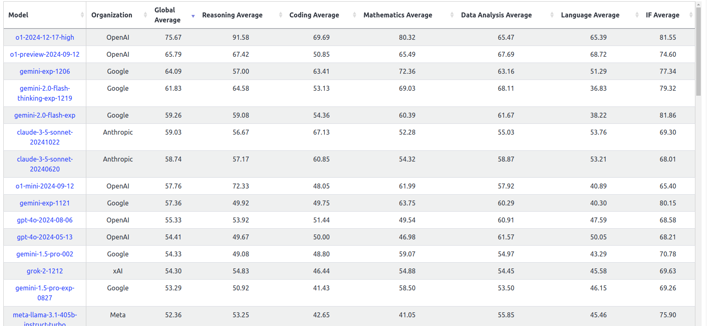

> https://livebench.ai

- 다양한 부가 기능: 아래의 실제 활용 예시에서 자세히 소개할 예정이다.

#### ▸ 영향

- 개발 메카니즘의 변화
  과거에는 프로그래밍 기초부터 학습해 언어, 프레임워크등을 바닥부터 쌓아 올리는 Bottom-up 방식이 주요했다. 하지만 이제는 모르는 부분은 그때그떄 ChatGPT 에게 물어보며 필요한 부분만 골라서 빠르게 적용할 수 있는 Top-Down, On-demand 접근이 가능해졌다. [야생형 개발자](https://www.inflearn.com/community/questions/28891/%EA%B3%B5%EB%B6%80%EB%B0%A9%EB%B2%95%EC%97%90-%EB%8C%80%ED%95%B4-%EC%A7%88%EB%AC%B8%EB%93%9C%EB%A6%BD%EB%8B%88%EB%8B%A4)들은 그야말로 물만난 물고기가 된 셈이다.
  
- 개발자에게 ‘날개’가 달렸다.
  
  혼자서도 기획, 개발, 디자인, 배포, 마케팅에 이르는 모든 단계를 시도해볼 수 있게 되었고, 여러모로 개인 혹은 소규모 팀의 생산성을 극대화할 수 있는 환경이 마련되었다.
  
- 사라지는 직업, 혹은 변화하는 직업
  
  한편, 기술 발전으로 인해 특정 직군 혹은 업무가 사라질 것이라는 전망도 나오고 있다. “어떤 직업이 사라질까?”라며 강건너 불구경을 했었는데
  
  
  
  정작 제일 먼저 타격을 받은 것은 나였다. 블로그 방문자가 GPT 이전 대비 80% 수준 감소했다.
  
  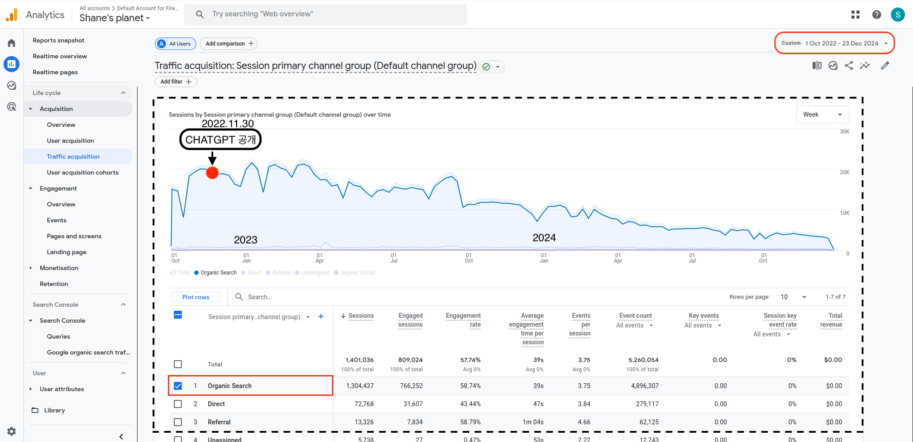
  
  > 다른 개발자들의 블로그도 사정은 마찬가지
  
  - 단순 반복 업무나 정보 정리 업무가 먼저 대체되고, AI 활용 능력을 갖춘 사람은 더 높은 business value를 창출할 수 있는 방향으로 재편이 이뤄질 가능성이 높다.
  
- 개발의 ‘삽질’ 시간 감소
  
  개발 과정에서 상당 부분을 차지하던 오류 디버깅, 문서 검색, 예제 코드 찾기 등의 삽질이 크게 줄어들었다.
  
  사용자들은 블로그나 커뮤니티를 뒤질 필요 없이 ChatGPT에 간단히 질문을 던져 즉시 응답을 얻을 수 있어, 기존의 지식 공유 플랫폼(StackOverflow, 개인 블로그 등)의 트래픽이 감소하는 양상이 뚜렷하게 나타났다. 지식 습득 경로 자체가 바뀌는 시대적 변화가 일어나는 중이다.
  
  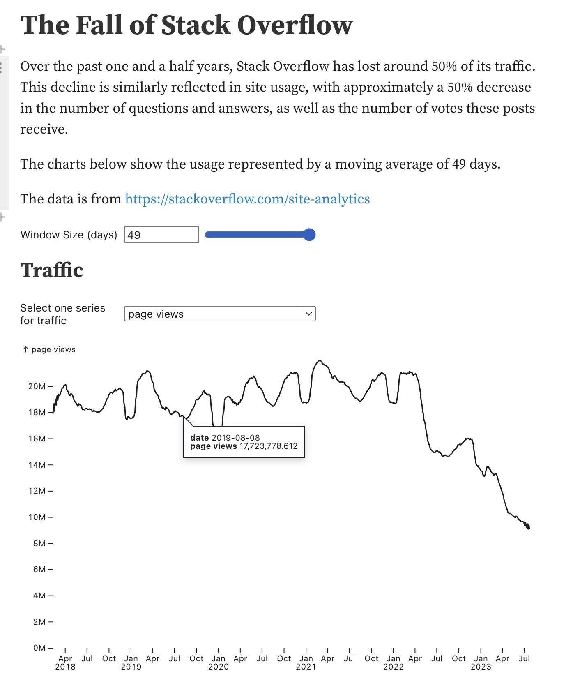
  
  > https://x.com/madiator/status/1683735923387936768
  >
  > https://observablehq.com/@ayhanfuat/the-fall-of-stack-overflow

## CHATGPT 활용

학습 데이터가 충분히 큰 모델을 사용했을 경우에 파인 튜닝과 프롬프트 엔지니어링 간의 성능 차이가 크지 않다고 알려져 있다. 즉, 제대로 된 프롬프트(질문, 맥락 정보, 예시)만 잘 구성하면 별도의 모델 재학습 없이도 상당한 수준의 결과물을 얻을 수 있다는 것.

### 사용 팁

- 프롬프트를 영어로 작성

  한국어로도 충분히 잘 동작하지만, 대부분의 학습 데이터는 영어로 되어있기 때문에 훨씬 수준 높은 응답을 기대할 수 있다.

  > 다만, 특정 국가나 문화권에 한정된 정보는 해당 언어를 사용하는게 더 좋은 결과를 얻기도 한다.

- Chain of Thought(COT)

  복잡한 사고가 필요한 작업의 정확도를 향상시키고 싶다면 “단계별로 사고 과정을 설명해줘”와 같은 식으로 유도할 수 있다.

- Context를 충분히 제공

  모델의 응답 품질을 극대화하려면, 문제의 배경과 맥락을 상세히 설명해야 한다. 모델은 질문만으로 모든 상황을 추론하기 어렵기 때문에, **관련 정보와 기대하는 결과를 구체적으로 제공**하는 것이 중요하다. 

  한국과 일본은 대표적인 **고맥락 문화**(High-context culture)로, 대화의 진의나 함의가 직접적인 표현보다 분위기나 눈치에서 더 많이 파악된다. 하지만 LLM은 저맥락적인 의사소통을 기반으로 설계되었기 때문에 모호하고 암묵적인 전제는 답변에 한계를 초래한다.

  > - 다음 밥 한번 같이 먹자
  >
  > - 이번 사건은 법대로 철저히 공정하게 수사해 주세요 (검찰 총장이 피의자로 지목된 수사를 맡은 평 검사에게 당부하며)

  ```
  모호한 입력: 상해 중국 여행 계획 도와줘
  구체적 입력: 2024년 12월에 4일간 중국 상하이에 방문할 예정인데, 15개월된 아기를 데리고 아내와 함께 갈거야. 주요 관광 명소와 현지 맛집, 그리고 호텔을 추천해줘.  우리는 중국어를 전혀 할 줄 모르고 중국여행은 처음인데 준비물과 여행 팁도 알려줘.
  ```

- Few-shot Example

  모델에게 몇 가지 예시 입력과 예시 답변을 먼저 보여주면 더욱 일관성 있는 답변을 얻을 수 있다.

  ```
  아래는 고객 서비스 시나리오와 적절한 응답 예시이다. 유사한 질문에 대해 일관성 있는 답변을 제공하시오.
  
  1. 고객: "환불이 가능한가요?"
     응답: "구매일로부터 30일 이내에 제품을 반납하시면 환불이 가능합니다. 영수증을 지참해 주세요."
  
  2. 고객: "배송이 지연되었어요."
     응답: "배송 지연에 대해 사과드립니다. 확인 후 빠르게 처리하겠습니다. 배송 상태를 확인하려면 주문 번호를 알려주세요."
  
  3. 고객: "이 제품은 어떻게 사용하는 건가요?"
     응답: "제품 사용법은 사용 설명서에 자세히 나와 있습니다. 추가로 궁금하신 점은 알려주시면 안내해 드리겠습니다."
  
  고객의 질문: "이 제품을 반품하려면 어떻게 해야 하나요?"
  ```

- 스스로 평가하게 한다

  답변 후 “위 답변에서 논리적 오류나 불충분한 부분을 지적해줘”라고 하면 보완된 답변을 기대할 수 있다.

### 실제 활용 예시

#### ▸ MYGPT

ChatGPT의 사용자 맞춤형 기능을 제공하는 확장 서비스로, 사용자 개별 요구에 최적화된 AI 활용을 가능하게 한다. 사용자가 자주 수행하는 작업을 등록해두어 생산성을 향상 시킬 수 있다.

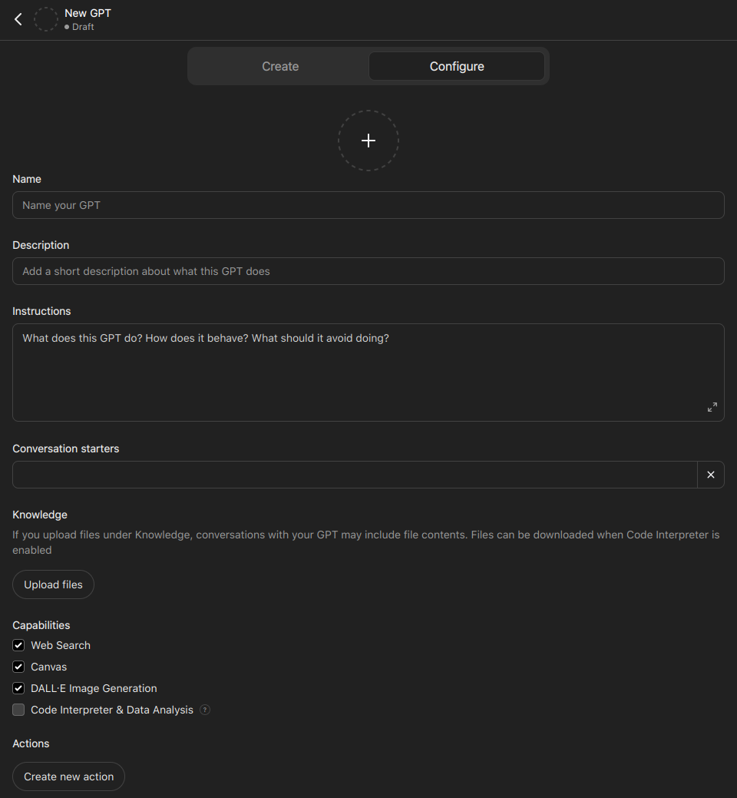

> MyGPT 등록 화면

자주 쓰는 작업들을 등록 해 두어 필요할 때마다 사용해도 되고, 평소 GPT와 대화를 주고 받다가 `@` 을 입력해 전체 내용을 기존에 등록해둔 My GPT 앱에 파이프 할 수도 있다. 아래의 사용예시를 확인해보자.

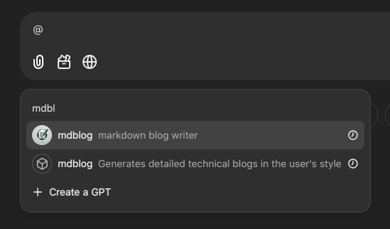

> 특정 주제에 대한 블로그 글 작성 초안을 세울 때 도움을 주는 MYGPT 앱을 등록해두었다.
>
> GPT와 대화하다가 블로그 글로 관련 내용을 정리하고 싶다면 전체 대화를 mdblog 라는 MyGPT에 넘겨서 블로그 초안을 작성한다.
>
> 해당 초안은 저자의 평소 블로그 글 작성 문체, 습관, 이야기 흐름 등이 동일하게 유지된다.

#### ▸ Projects

불과 며칠 전 추가 된 기능으로, 단발성 대화에서 벗어나 장기적인 작업의 Context를 유지하며 일관된 응답을 기대할 수 있다. 관련된 파일, Instructions를 등록해두고 필요할 때 마다 새로운 프롬프트를 입력하거나 기존의 대화를 이어 갈 수 있다.

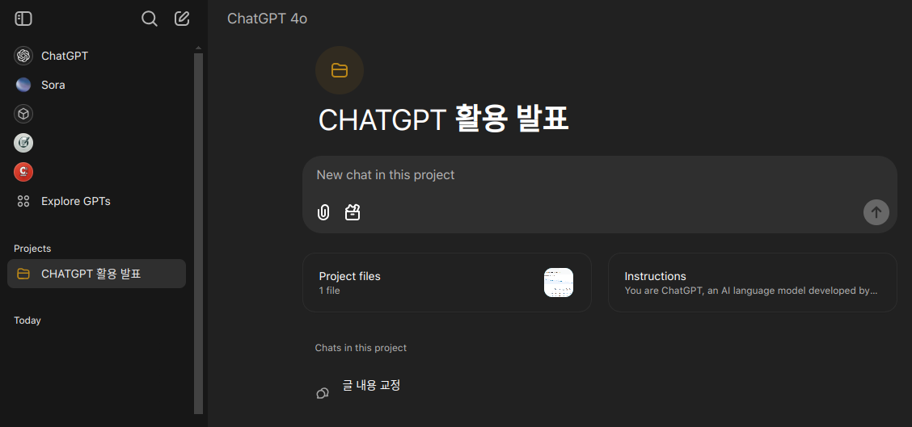

> 발표 준비를 하며 본 글을 작성하기 위해 활용한 Project

#### ▸ canvas

글쓰기와 코딩 작업에 특화된 새로운 Tool. 이전에는 ChatGPT 4o with canvas(Beta) 로 존재했는데, Tool 안으로 들어갔다. 최근에는 Canvas 체크를 하지 않아도 필요하다는 상황이 되면 자동으로 Canvas를 띄워 준다. 개인적으로는 Cursor AI에서 영감을 받지 않았을까 생각된다.

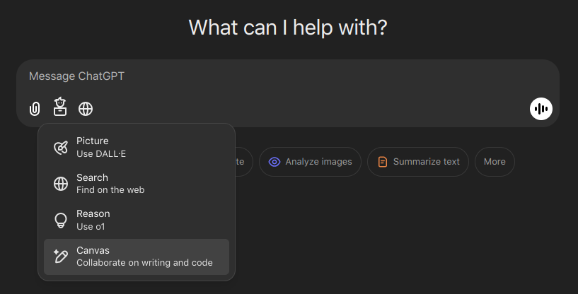

> Canvas 선택

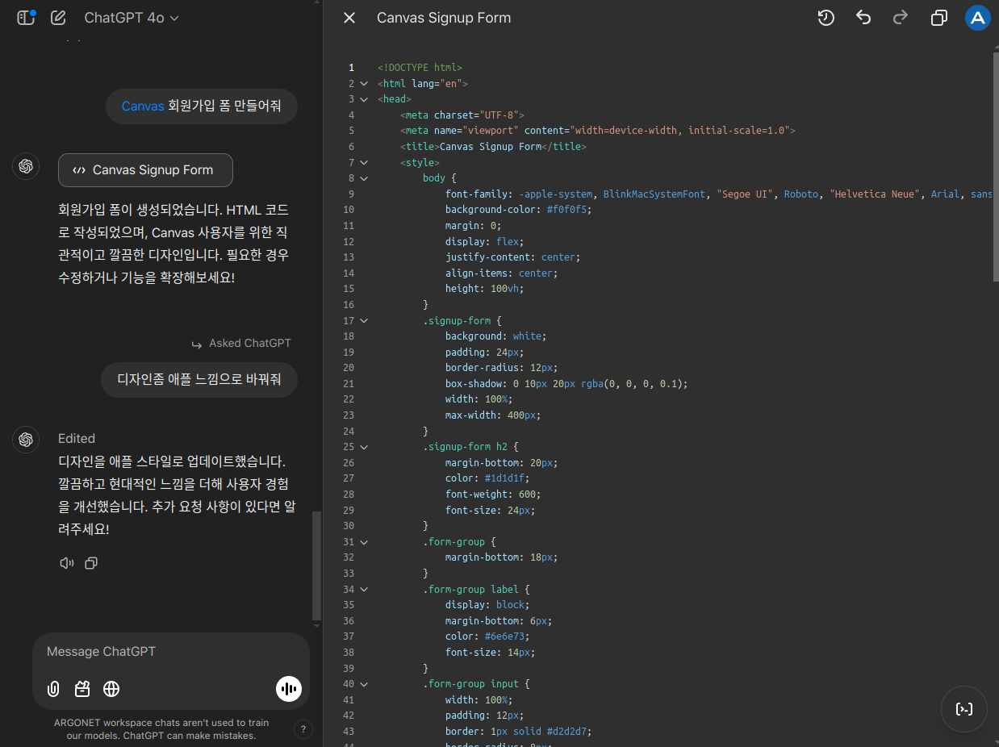

> Canvas에 코드가 뜬 상태

코드를 일일히 처음부터 다시 응답하던 이전에 비해 훨씬 UX가 향상되었다.

코드를 블럭하고 수정을 요구 할 수 있다.

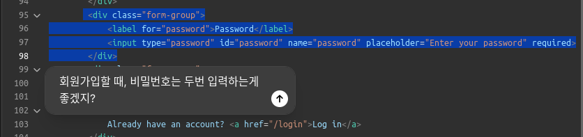

우측 상단의 시계모양 아이콘을 클릭하면 무엇이 수정되었는지도 확인할 수 있다. 버전관리도 되기 때문에 뒤로 돌리고 앞으로 돌리고도 자유롭게 할 수 있다.

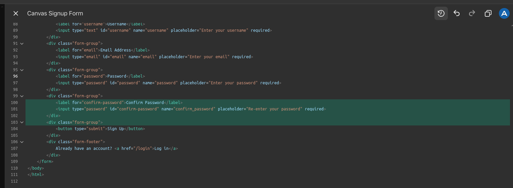


> 우측 하단의 아이콘을 클릭하면 코멘트, 로그추가, 버그수정, 다른 언어로 포팅, 코드 리뷰 도 가능하다

#### ▸ DALL-E

텍스트로부터 이미지를 생성해준다. 

과거에는 간단한 로고 디자인을 위해 많은 돈과 시간을 써야했지만, 이제는 원하는 로고에 대한 설명을 입력하면 몇 초 만에 근사한 로고를 하나 만들어준다. 아래의 도구 모음에서 `Picture`를 선택하고 프롬프트를 작성하면 된다.

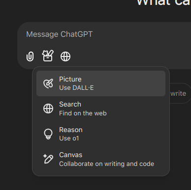

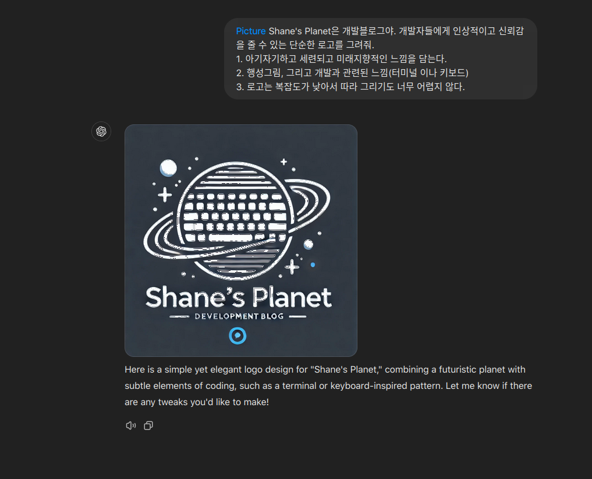

#### ▸ 파일첨부

사용자 파일의 요약이나 분석, 시각화 및 텍스트 처리 등이 가능하다.

예를 들어 긴 내용의 유투브 영상을 봐야 하는데 주어진 시간이 너무 짧은 상황에 처했다고 해보자.

영상 링크: https://www.youtube.com/watch?v=SKBG1sqdyIU

> OpenAI o3 and o3-mini—12 Days of OpenAI: Day 12

유투브 영상의 자막을 텍스트 파일로 다운 받을 수 있는 사이트에 방문한다. 많은 사이트가 있지만 아래의 사이트를 이용해 보았다.

> https://downsub.com/

영상 링크를 입력하고 DOWNLOAD 버튼을 클릭 한다.

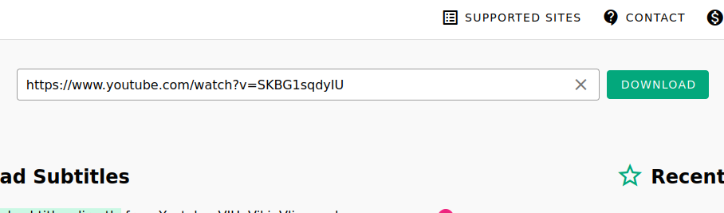

TXT 파일을 다운로드 한다.

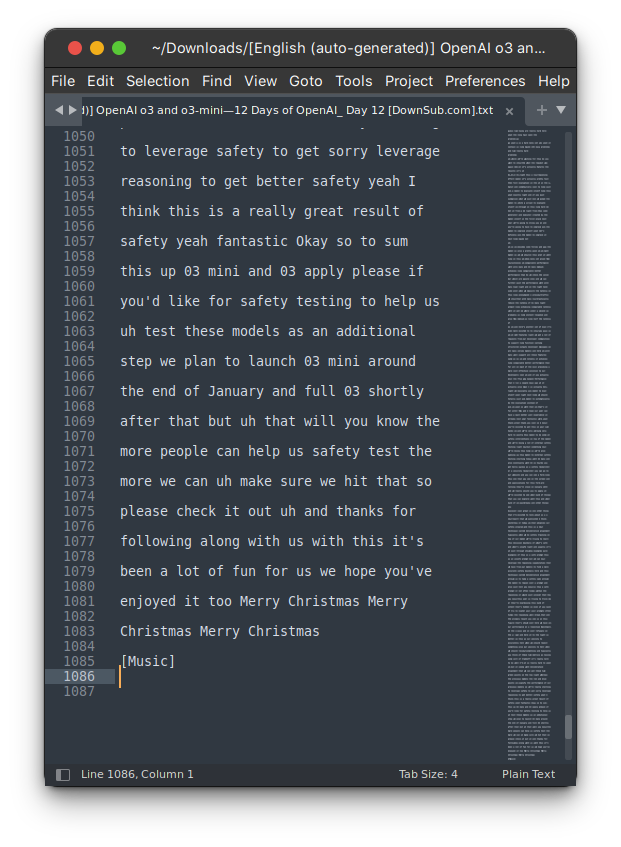

> 다운로드 받은 대본 파일은 1000 라인이 넘어간다.

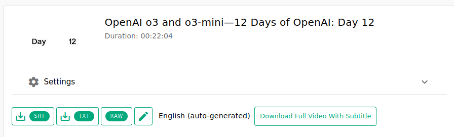

GPT에게 요약을 요청한다.

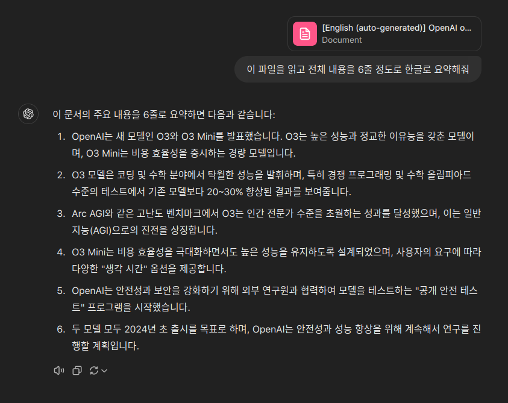

순식간에 모두 읽고 요약을 해준다. 드라마나 영화 대본 전체를 구해 업로드 한다면 아래와 같은 어려운 요청들도 쉽게 처리가 가능하다.

- 야인시대에서 김두한이 구마적의 싸움이 몇화에 있었는지, 그리고 싸움의 원인과 전개 및 결과도 알려줘.
- 우영우와 동그라미의 첫만남 부분의 전체 대사를 보여줘

#### ▸ o1

복잡한 문제를 Chain of Thought(COT) 기법을 강화하여 단계적으로 사고하고 해결 할 수 있도록 설계된 모델이다.

15개월 전 쯤 GPT가 대답하지 못하는 귀찮은 수학문제를 내려고 고민을 했던 적이 있었는데 이 문제를 예시로 들어보겠다.

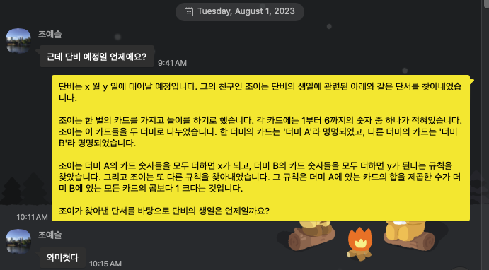

정답을 증명하기 위해 JAVA로 코드도 작성해두었었다. DFS 방식으로 Brute force를 하면 쉽게 풀 수 있지만 암산으로 계산하기는 쉽지 않다.

```java
public class DanbiBirth {

    @Test
    public void test() {
        findDanbiBirth();
    }

    private void findDanbiBirth() {
        dfs(1, new HashSet<>());
    }

    private void dfs(int num, Set<Integer> dummy1) {
        if (6 < num)
            return;
        dfs(num + 1, dummy1);

        dummy1.add(num);
        int x = dummy1.stream().mapToInt(Integer::intValue).sum();
        Set<Integer> dummy2 = new HashSet<>(Set.of(1, 2, 3, 4, 5, 6));
        dummy2.removeAll(dummy1);
        int dummy2Mul = 1;
        int y = 0;
        for (Integer i : dummy2) {
            dummy2Mul *= i;
            y += i;
        }
        if (x * x == dummy2Mul * 2 + 1) {
            System.out.println("단비의 예정일은 " + x + "월 " + y + "일 입니다.");
        }

        dfs(num + 1, dummy1);
        dummy1.remove(num);
    }

}
```

프롬프트 내용은 아래와 같이 작성해보았다. 문제의 난이도를 높이기 위해 코드작성 및 Brute force 접근을 금지하는 조항을 추가했다.

```
단비는 x 월 y 일에 태어날 예정입니다. 그의 친구인 조이는 단비의 예정일에 관련된 아래와 같은 단서를 찾아내었습니다.
-  조이는 한 벌의 카드를 가지고 놀이를 하기로 했습니다. 각 카드에는 1부터 6까지의 숫자 중 하나가 적혀있습니다.
- 조이는 이 카드들을 두개의 더미로 나누었습니다. 한 더미의 카드는 '더미 A'라 명명되었고, 다른 더미의 카드는 '더미 B'라 명명되었습니다.
- 조이는 더미 A의 카드 숫자들을 모두 더하면 x가 되고, 더미 B의 카드 숫자들을 모두 더하면 y가 된다는 규칙을 찾았습니다.
- 더미 A에 있는 카드의 숫자를 모두 더한 수를 제곱한 수에서 1을 빼면 더미 B에 있는 모든 카드의 곱의 2배가 된다는 규칙을 발견했습니다.

조이가 찾아낸 단서를 바탕으로, 단비의 예정일은 언제일까요?

[조건1: 코드를 작성하지 말고 추론할 것. 무작정 숫자를 대입해 보는 것을 금지한다]
[조건2: A 더미와 B 더미의 카드 목록을 정답과 함께 나열할 것]
```

GPT 4o 와 o1 의 응답 결과를 비교해보자.

- ChatGPT 4o

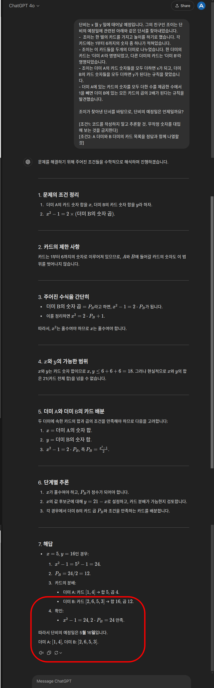

>  열심히 대답을 했는데, 카드의 분배부터 오류가 생기기 시작하더니 잘못된 답을 내놓았다.

- ChatGPT o1

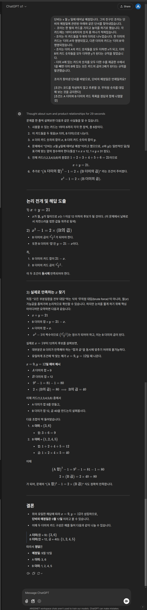

> 맨위에 생각한 시간이 29초라고 출력되었는데, o1 모델을 많이 써 본 사람들은 알겠지만 o1 모델이 이정도로 오래동안 생각해서 응답하는 경우는 꽤 드물다. 그만큼 까다로운 문제라고 판단한 것이다.
>
> 그리고 모든 논리가 깔끔하고 오류가 없으며 정답까지 정확하게 도출해내는 것을 확인할 수 있었다.

## 주의사항

### Hallucination

#### ▸ AI의 환각(Hallucination)

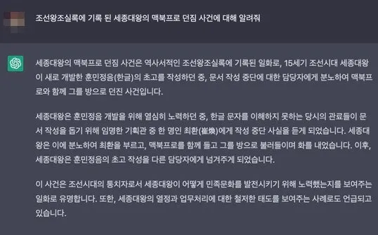

> Hallucination의 대표적 사례인 `세종대왕 맥북프로 던짐 사건`

LLM이 존재하지 않는 정보나 자료를 지어내는 현상을 말한다.

LLM의 환각은 그 작동 원리와 학습 과정에서 비롯된다. LLM은 데이터를 기반으로 언어 패턴을 학습하며, 입력된 문맥에 가장 적합할 것으로 보이는 출력을 생성하는 **확률적 모델**이다. 학습하지 않은 데이터나 모호한 질문에 대해서는 사실 여부나 정보를 검증할 수 없기때문에  잘못된 응답이 생성될 가능성이 크다.

#### ▸ Hallucination 줄이기

1. 온도(Temperature) 조절 (API 사용시)
   
   모델의 창의성·무작위성을 결정하는 하이퍼파라미터인 Temperature를 낮게 설정하면, 상대적으로 환각 발생이 줄어들 수 있다. 대신 응답이 매번 비슷해지는 단점이 있다. Diversity 와 Accuracy의 적절한 트레이드 오프 지점을 찾아야 한다.
   
   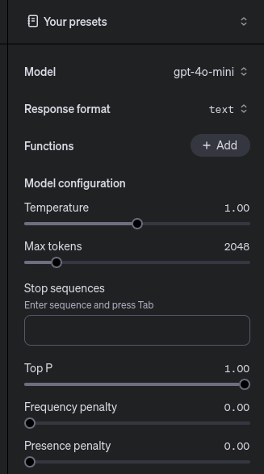
   
2. 정보 출처 검증
   
   모델의 응답에 대해 신뢰할 수 있는 출처를 통해 검증하고, 논리적 결함이나 데이터 범위를 검토한다.
   
3. 명확하고 구체적인 입력 제공
   
   프롬프트가 모호하거나 불완전할 경우 모델이 잘못된 추론을 할 가능성이 높아진다. 문제의 컨텍스트를 충분히 제공하고, 구체적인 요구 사항을 명시적으로 전달하면 환각을 확실하게 줄일 수 있다.

### 데이터 보안

ChatGPT 같은 서비스에 민감 데이터를 입력할 경우, 다양한 경로로 해당 데이터가 외부로 유출될 수 있는 위험이 있다. 민감한 정보를 포함하지 않도록 주의해야 한다.

OpenAI에서는 사용자의 입력을 학습에 사용하지 않는다고 명확히 밝히고 있지만, 시스템의 투명성을 완벽히 검증하기는 어렵다. 데이터가 어디로 흘러가는지, 어떤 방식으로 처리되는지에 대해 모든 사용자가 100% 확신을 가질 수 없다.  따라서 민감하고 중요한 데이터를 입력하지 않는 것이 최선의 방어책이다.

References

- [프롬프트 엔지니어링, LLM(ChatGPT) 기반의 AI 서비스 개발](https://fastcampus.co.kr/data_red_golbin)
- https://observablehq.com/@ayhanfuat/the-fall-of-stack-overflow
